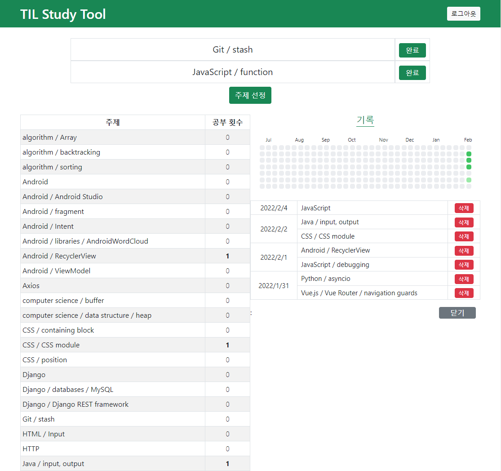

# TIL Study Tool

[사이트 링크](https://til-study-tool.netlify.app/)

[TIL](https://github.com/WoosubLeee/TIL)(Today I Learned)에 정리한 공부 내용을 효율적으로 복습하기 위해 제작한 사이트입니다.

## Features

- 복습할 주제를 무작위로 추출
- 복습 기록 조회
- 복습 기록 저장(not available for public visitors)
- 주제 목록을 한 눈에 조회
- 로그인 기능

## Stack

- Front-end : React 17.0.2, Bootstrap 5
- Back-end : Firebase(Realtime database, Authentication)

